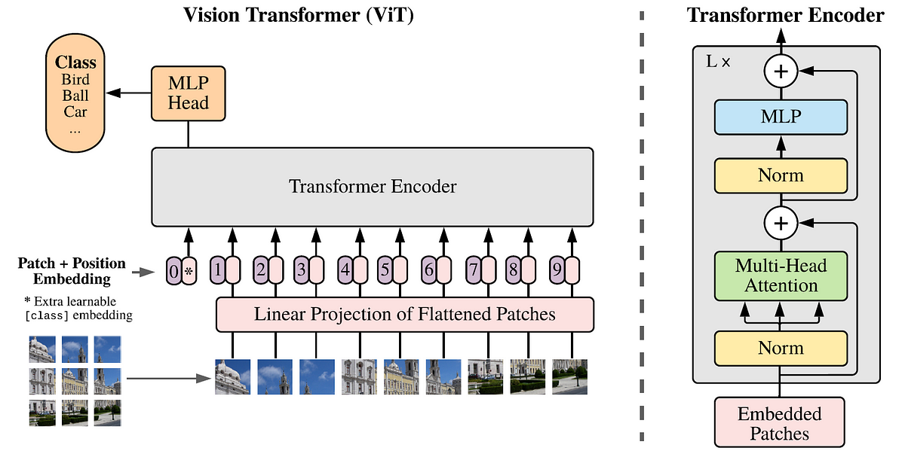

# ViT-pytorch
🚀ViT(Vision Transformer) Model by Pytorch

- Model : ViT (Vision Transformer)
- Paper : [An Image is Worth 16x16 Words: Transformers for Image Recognition at Scale](https://arxiv.org/abs/2010.11929)  
- Architecture :   

## Paper Review by KOR :
- [Notion](https://bottlenose-oak-2e3.notion.site/An-Image-is-Worth-16x16-Words-Transformers-for-Image-Recognition-at-Scale-95a255d7a95e4365b6d8dc8d3fb8d9ec?pvs=4)

## 참고한 코드
- [FrancescoSaverioZuppichini-ViT](https://github.com/FrancescoSaverioZuppichini/ViT)